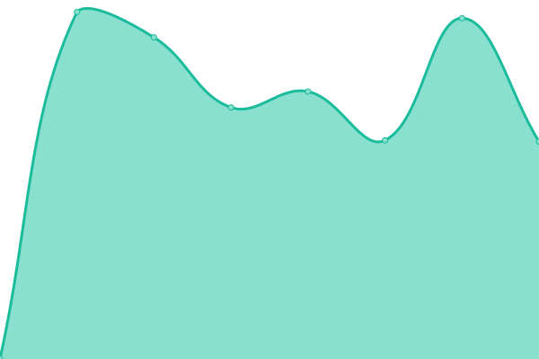
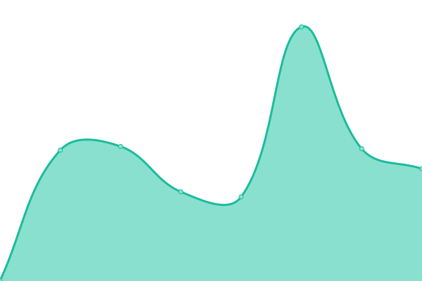
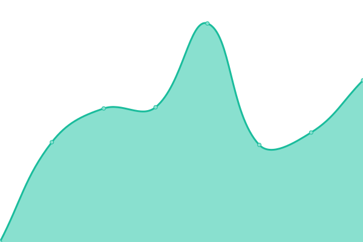

# [📈 Live Status](https://ramos-developer.github.io/upptime): <!--live status--> **🟧 Partial outage**

This repository contains the open-source uptime monitor and status page for [ramos-developer](https://ramos-developer.github.io/upptime), powered by [Upptime](https://github.com/upptime/upptime).

With [Upptime](https://upptime.js.org), you can get your own unlimited and free uptime monitor and status page, powered entirely by a GitHub repository. We use [Issues](https://github.com/ramos-developer/upptime/issues) as incident reports, [Actions](https://github.com/ramos-developer/upptime/actions) as uptime monitors, and [Pages](https://ramos-developer.github.io/upptime) for the status page.

<!--start: status pages-->
<!-- This summary is generated by Upptime (https://github.com/upptime/upptime) -->
<!-- Do not edit this manually, your changes will be overwritten -->
<!-- prettier-ignore -->
| URL | Status | History | Response Time | Uptime |
| --- | ------ | ------- | ------------- | ------ |
|  [SOCIOS-ALGODOLIVA](https://socios.algodoliva.es) | 🟩 Up | [socios-algodoliva.yml](https://github.com/ramos-developer/upptime/commits/HEAD/history/socios-algodoliva.yml) | 

 900ms
     
 | 

<a href="https://ramos-developer.github.io/upptime/history/socios-algodoliva">99.67%</a>
    

|  [SOCIOS-EUROPEOS](https://socios.scaeuropeos.com) | 🟩 Up | [socios-europeos.yml](https://github.com/ramos-developer/upptime/commits/HEAD/history/socios-europeos.yml) | 

 914ms
     
 | 

<a href="https://ramos-developer.github.io/upptime/history/socios-europeos">100.00%</a>
    

|  [SOCIOS-LADEHESA](https://socios.ladehesasca.es) | 🟩 Up | [socios-ladehesa.yml](https://github.com/ramos-developer/upptime/commits/HEAD/history/socios-ladehesa.yml) | 

 877ms
     
 | 

<a href="https://ramos-developer.github.io/upptime/history/socios-ladehesa">100.00%</a>
    

|  [SOCIOS-AGROJARA](https://socios.agrojara.es) | 🟩 Up | [socios-agrojara.yml](https://github.com/ramos-developer/upptime/commits/HEAD/history/socios-agrojara.yml) | 

 833ms
     
 | 

<a href="https://ramos-developer.github.io/upptime/history/socios-agrojara">100.00%</a>
    

|  [APP-FERRELIAS](https://app.ferreteriaelias.es) | 🟥 Down | [app-ferrelias.yml](https://github.com/ramos-developer/upptime/commits/HEAD/history/app-ferrelias.yml) | 

 825ms
     
 | 

<a href="https://ramos-developer.github.io/upptime/history/app-ferrelias">99.99%</a>
    

|  [APP-QUIJADA](https://qym.grupoquijada.com) | 🟥 Down | [app-quijada.yml](https://github.com/ramos-developer/upptime/commits/HEAD/history/app-quijada.yml) | 

 530ms
     
 | 

<a href="https://ramos-developer.github.io/upptime/history/app-quijada">99.99%</a>
    

|  [APP-PREFABRICADOS](https://app.grupoquijada.com) | 🟥 Down | [app-prefabricados.yml](https://github.com/ramos-developer/upptime/commits/HEAD/history/app-prefabricados.yml) | 

 585ms
     
 | 

<a href="https://ramos-developer.github.io/upptime/history/app-prefabricados">98.73%</a>
    

|  [ALGODO-TIENDA](https://algodoliva.es/tienda/) | 🟩 Up | [algodo-tienda.yml](https://github.com/ramos-developer/upptime/commits/HEAD/history/algodo-tienda.yml) | 

 1950ms
     
 | 

<a href="https://ramos-developer.github.io/upptime/history/algodo-tienda">100.00%</a>
    

|  [WS-BUS-OSUNA](https://bus.osuna.es) | 🟩 Up | [ws-bus-osuna.yml](https://github.com/ramos-developer/upptime/commits/HEAD/history/ws-bus-osuna.yml) | 

 1398ms
     
 | 

<a href="https://ramos-developer.github.io/upptime/history/ws-bus-osuna">100.00%</a>
    

|  [INFO-BUS-OSUNA](https://info.osuna.es) | 🟩 Up | [info-bus-osuna.yml](https://github.com/ramos-developer/upptime/commits/HEAD/history/info-bus-osuna.yml) | 

 725ms
     
 | 

<a href="https://ramos-developer.github.io/upptime/history/info-bus-osuna">100.00%</a>
    

<!--end: status pages-->

[**Visit our status website →**](https://ramos-developer.github.io/upptime)

## 📄 License

- Powered by: [Upptime](https://github.com/upptime/upptime)
- Code: [MIT](./LICENSE) © [ramos-developer](https://ramos-developer.github.io/upptime)
- Data in the `./history` directory: [Open Database License](https://opendatacommons.org/licenses/odbl/1-0/)
